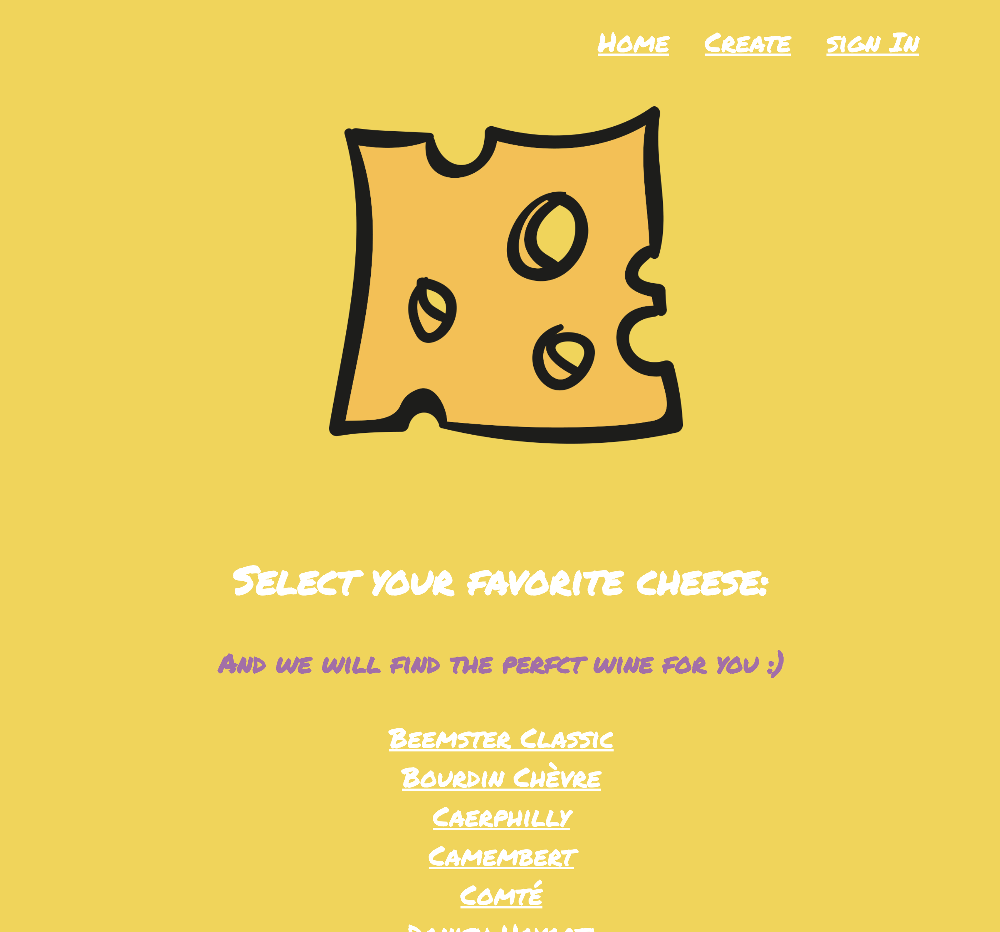

# Cheeses Wines Suggestion

Cheeses Wines Suggestion is a project when you can see a list of cheeses and if you select one you will receive a wine suggestion.  
I created that project in order to learn more about fetching APIs, React, and requests.

## Technologies

React, Express, and Node.js.
External API integration.

## Installation

Just clone the repo and run npm install and npm start.

```
npm install
npm start
```

## Contributing
Pull requests and suggestions are welcome.

## Quick Look


